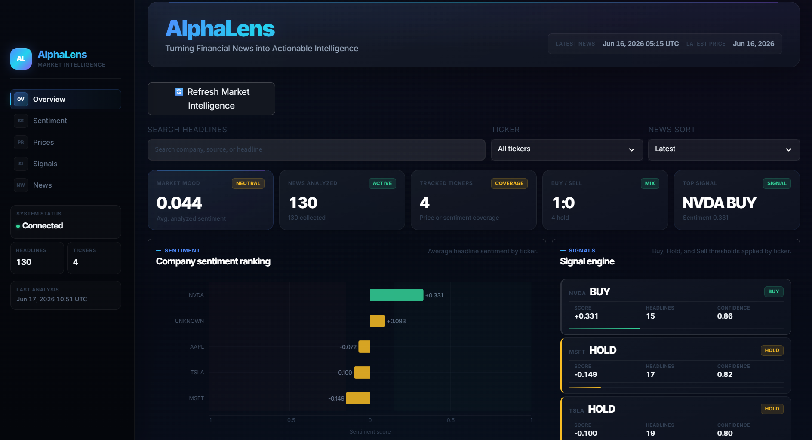

# AlphaLens


**Turning Financial News into Actionable Intelligence**

AlphaLens is a financial intelligence pipeline that collects market news, analyzes it with a finance-specific language model, tracks multi-ticker price data, and turns the result into simple, explainable market signals.

The project is built to stay understandable. Data flows through plain Python scripts, SQLite tables, CSV snapshots, and a Streamlit dashboard, so every signal can be traced back to the headlines and prices that produced it.

---

## Project Overview

Financial news is constant, noisy, and often hard to translate into action. AlphaLens gives that stream some structure.

It collects relevant headlines, scores them with FinBERT, stores the results in SQLite, tracks price history with yFinance, and generates Buy/Hold/Sell signals from aggregated sentiment. The dashboard then gives a compact view of market mood, company-level sentiment, and signal direction.

AlphaLens is not a trading bot and it does not place orders. Think of it as an analyst workstation for exploring how financial news sentiment lines up with market behavior.

---

## Key Statistics

| Metric                  | Value              |
| ----------------------- | ------------------ |
| Tracked Companies       | 4                  |
| News Articles Processed | 180+               |
| Database                | SQLite             |
| Sentiment Model         | FinBERT            |
| Signals Generated       | Buy / Hold / Sell  |
| Dashboard               | Streamlit + Plotly |
| Market Data Source      | yFinance           |
| News Source             | NewsAPI            |


## Architecture Diagram

```text
                              +------------------+
                              |     NewsAPI      |
                              +---------+--------+
                                        |
                                        v
                              +------------------+
                              | collectors/      |
                              | get_news.py      |
                              +---------+--------+
                                        |
                                        v
+------------------+          +------------------+
|    yFinance      |          | news_data/       |
+---------+--------+          | CSV snapshots    |
          |                   +---------+--------+
          v                             |
+------------------+                    v
| collectors/      |          +------------------+
| get_prices.py    |          | database/        |
+---------+--------+          | save_*.py        |
          |                   +---------+--------+
          +-----------+-----------------+
                      |
                      v
              +------------------+
              | SQLite Database  |
              | news             |
              | sentiment        |
              | prices           |
              +---------+--------+
                        |
                        v
              +------------------+
              | FinBERT Analysis |
              | analyze_news.py  |
              +---------+--------+
                        |
                        v
              +------------------+
              | Signal Engine    |
              | generate_signals |
              +---------+--------+
                        |
                        v
              +------------------+
              | Streamlit +      |
              | Plotly Dashboard |
              +------------------+
```

---

## Why I Built AlphaLens

Financial news moves markets quickly, but manually tracking hundreds of headlines and understanding their impact is difficult.

AlphaLens was built to automate this process by collecting financial news, analyzing sentiment using FinBERT, aggregating company-level sentiment, and generating actionable Buy/Hold/Sell signals through an interactive dashboard.

## Features

### News Collection

AlphaLens collects market-related headlines from NewsAPI and stores them as local CSV snapshots before importing them into SQLite.

### Financial Sentiment Analysis

Headlines are scored with FinBERT, a transformer model tuned for financial language. The sentiment output is converted into signed sentiment values for aggregation and signal generation.

### Multi-Ticker Price Tracking

The project downloads recent price history for supported tickers through yFinance and imports all available ticker price files into the `prices` table.

### BUY / HOLD / SELL Signal Generation

Sentiment is aggregated by ticker and translated into clear Buy, Hold, or Sell signals using transparent thresholds.

### Interactive Dashboard

The Streamlit dashboard visualizes market mood, sentiment ranking, news distribution, and generated signals with Plotly charts.

### Pipeline Runner

`run_pipeline.py` runs the full workflow in order and stops on the first failure, which keeps the pipeline predictable when working locally.

---

## Dashboard Preview

### Overview Dashboard



### Trading Signals


### News Intelligence Feed


## Current Coverage

Currently tracked companies:

- NVIDIA (NVDA)
- Microsoft (MSFT)
- Apple (AAPL)
- Tesla (TSLA)

The ticker mapping layer can be extended to support additional companies and ETFs.


## Tech Stack

- Python
- SQLite
- FinBERT
- NewsAPI
- yFinance
- Streamlit
- Plotly
- pandas

---

## Installation

Clone the repository:

```bash
git clone https://github.com/harshjs19/AlphaLens.git
cd AlphaLens
```

Create a virtual environment:

```bash
python -m venv venv
```

Activate it on Windows:

```bash
venv\Scripts\activate
```

Activate it on macOS or Linux:

```bash
source venv/bin/activate
```

Install dependencies:

```bash
python -m pip install -r requirements.txt
```

Create a `.env` file in the project root:

```text
NEWS_API_KEY=your_newsapi_key_here
```

Initialize the SQLite database:

```bash
python database/setup_db.py
```

---

## Usage

Run the complete AlphaLens pipeline:

```bash
python run_pipeline.py
```

Launch the dashboard:

```bash
streamlit run dashboard/app.py
```

You can also run individual steps while debugging:

```bash
python collectors/get_news.py
python database/save_news.py
python collectors/get_prices.py
python database/save_prices.py
python analysis/analyze_news.py
python analysis/generate_signals.py
```

---

## Pipeline Flow

The pipeline runs in this order:

```text
1. collectors/get_news.py
   -> Pull latest headlines from NewsAPI
   -> Save news_data/news.csv

2. database/save_news.py
   -> Import new headlines into SQLite
   -> Avoid duplicate titles

3. collectors/get_prices.py
   -> Download recent ticker prices from yFinance
   -> Save news_data/*_prices.csv

4. database/save_prices.py
   -> Import all available ticker price CSVs
   -> Normalize symbol, date, close price, and volume
   -> Avoid duplicate symbol/date rows

5. analysis/analyze_news.py
   -> Run FinBERT sentiment analysis
   -> Store sentiment labels, confidence scores, and signed values

6. analysis/generate_signals.py
   -> Aggregate sentiment by ticker
   -> Generate Buy/Hold/Sell signals
```

Current database tables:

```text
news       -> raw collected headlines
sentiment  -> FinBERT sentiment output by headline
prices     -> multi-ticker close price and volume history
```
The modular pipeline design allows every generated signal to be traced back to its source news articles, sentiment scores, and underlying price data.
---

## Future Enhancements

- Price impact analysis between sentiment events and forward stock returns
- Confidence scoring for each ticker signal
- Sentiment and price overlays by company
- Company drilldown pages with headline evidence
- Source quality and source impact analytics
- Better entity detection for headlines that mention multiple companies
- Rolling sentiment, volatility, and volume anomaly features
- Database migrations, indexes, and stronger constraints
- Automated tests and CI
- Hosted dashboard deployment
- Exportable analyst reports

---

## Disclaimer

This project is intended for educational and research purposes only.

The generated Buy/Hold/Sell signals are based on sentiment analysis and should not be considered financial advice.

Always perform independent research before making investment decisions.

## License

AlphaLens is released under the MIT License.

